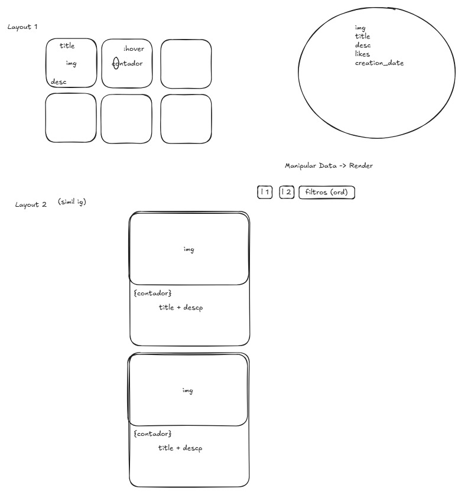

# Galería de Tarjetas - Primer Parcial Grupo 5

Proyecto de galería interactiva con tarjetas con likes, ordenamiento y dos layouts diferentes (grilla y feed).

## Esquema de datos y layout
<p align="center">
  
</p>

## Qué está hecho

**Estructura base (HTML + CSS) + Javascript**

- Maquetado responsivo con Flexbox.
- Tarjetas con imagen, titulo, descripción y botón de like
- CSS modular (variables, componentes separados) + sistema de 4px para spacing
- Dos layouts: grilla (Flex) y feed (por hacer)
- Botones de control: cambiar layout, ordenar por likes, ordenar por fecha
- Render de tarjetas desde fuente de datos en JS/JSON (sin tocar HTML)
- Contador de likes con click, persistencia temporal
- Modal para visualizar tarjeta expandida
- Ordenamiento dinámico
- Cambio entre layouts sin recargar
- Persistencia de estado de layout y filtros

## Cómo funciona

En vez de hardcodear el HTML con cada tarjeta, usamos una fuente de datos en JavaScript (cards.js) y un renderizador que construye dinámicamente el DOM.
Si se quiere cambiar contenido o agregar tarjetas, solo se modifica el archivo de datos y el render se actualiza automáticamente.

## Estructura del proyecto

```
├── .gitignore
├── README.md
├── index.html          (JS renderiza las cards)
├── css/
│   ├── style.css       (importa todo)
│   ├── variables.css   (colores, espacios, sombras)
│   ├── general.css     (resets, estilos globales)
│   └── components/
│       ├── card.css          (estilos de tarjeta)
│       ├── controls.css      (botones de control)
│       ├── modal.css         (layout modal)
│       ├── layout.css        (layout global)
│       ├── layout-flex.css   (contenedor grilla)
│       ├── layout-feed.css   (contenedor feed)
│       └── layout-mobile.css (reglas responsive unificadas)
├── js/
│   ├── data/
│   │   └── cards.js         (cards data)
│   └── scripts.js           (script central)
└── assets/
    ├── favicon/
    └── images/
```

## Estructura JS

La lógica de la aplicación está centralizada en scripts.js y sigue un enfoque de render basado en datos + funciones puras auxiliares.

**1.Fuente de datos**

```js
// js/data/cards.js
export const cards = [ ... ]
```

Es un array de objetos Card
Cada tarjeta contiene:
id
img (url + alt)
title
desc
creationDate
likes

Este archivo actúa como fuente de verdad inicial

Ambos layouts (grilla y feed) van a usar el mismo renderizador. La diferencia va a ser el contenedor afuera y el CSS que lo acompaña. Así cualquier cambio en los datos se refleja automático en los dos.

**2. Creación de nodos**

```js
const createNode = (tag, attributes = {}) => { ... }
```

Función genérica para crear elementos del DOM:

Recibe:
tag: nombre del elemento (div, img, etc.)
attributes: propiedades y atributos
Retorna:
Un HTMLElement tipado correctamente

Permite evitar document.createElement repetitivo
Soporta props del DOM (innerText, value, etc.) y atributos HTML (aria-_, data-_, etc.)

**3. Factory de tarjetas**

```js
const createCard = (card) => { ... }
```

Construye el HTML de una tarjeta (article)
Agregar estructura interna:

- imagen
- contenido
- acciones (likes)
- Manejar interacción de likes (click en botón de like)
- Manejar interacción con modal (click sobre card)
- Cada tarjeta es independiente y encapsula su propio comportamiento

**4. Ordenamiento dinámico**

```js
const orderCards = (cards) => { ... }
```

- No muta el array original (slice())
- Ordena según criterio (likes o creationDate) y dirección (ASC / DESC)

**5. Renderizado**

```js
const renderCards = () => { ... }
```

Responsable de:

- Limpiar el contenedor
- Obtener tarjetas ordenadas
- Generar cada tarjeta con createCard
- Insertarlas en el DOM

Es el punto central de actualización de UI. Permite cambiar el orden sin afectar la fuente de datos

**6. Eventos de UI**

```js
ORDER_BTN.addEventListener(...)
ORDER_BY_BTN.addEventListener(...)
GRID_LAYOUT_BTN.addEventListener(...)
FEED_LAYOUT_BTN.addEventListener(...)
```

Permiten:

- Cambiar orden (asc/desc)
- Cambiar criterio (likes/fecha)
- Alternar layouts (grilla / feed)

Todos los cambios terminan llamando a renderCards()

**7. Inicialización**

Valida la persistencia de filtros y layout en localStorage y ejecuta render inicial

```js
const init = () => {
        /* validaciones persistencia */

        renderCards()
}

init();
```

## Flujo general

```
Render inicial al cargar la página

Usuario interactúa (click / change)
        ↓
Se actualiza estado (likes / orden / layout)
        ↓
renderCards()
        ↓
Se reconstruye el DOM
        ↓
UI actualizada
```

## Decisiones técnicas

**Render dinámico completo**
- Se reconstruye el DOM en cada cambio 
- Simple y predecible para este tamaño de app

**Separación de responsabilidades**
- Datos → cards.js
- Lógica → scripts.js
- Estilos → CSS modular

**Persistencia**
- La app guarda en localStorage el layout elegido (GRID o FEED) y las preferencias de orden (orderBy y order).
- Los likes no se persisten, se actualizan en memoria durante la sesión y vuelven a su valor inicial al refrescar.

**Uso de JSDoc**
- Tipado sin necesidad de TypeScript
- Mejora autocompletado y mantenibilidad

**Diseño responsive**
- En mobile se fuerza el layout de feed y se ocultan los botones de cambio de layout.

### Criterios CSS
- **Clases CSS**: BEM (`.card__title`, `.card__actions`, etc.)
- **Espacios**: 4px base (8, 12, 16, 24, 40, 48px)
- **Variables**: Todo en `variables.css` (colores, sombras, espacios)


## Integrantes

- Vladimir Kozik
- Conrado Lanusse
- Laureano Kronemberger
- Santino Aloisio
- Francisco Jaszczuk

### Acciones
**Conrado Lanusse**
- Participé del diseño inicial y del prototipado del proyecto.
- Cree las funciones base de creacion de nodos, tarjetas y render.
- Agregué documentación y tipados con JSDoc
- Hice limpieza y refactorización final de scripts.js (orden, referencias, funciones, docs)
- Eliminé archivos y variables en desuso
- Agregué funcion init() con control de render inicial
- Agregué documentación general del proyecto a README.md

**Laureano Kronemberger**
- Ordenamiento de cards según fecha o likes.
- Retoque de estilos y media queries para diseño responsive.
- Manejo de eventos JS.
- Implementacion de persistencia localStorage para el criterio de orden (orderBy), la dirección del orden (order) y el layout seleccionado (layoutType).
  
**Vladimir Kozik**
- Participe en el armado de la estructura inicial del proyecto y dejé el README base para empezar a documentar el trabajo.
- Agregué los assets y los archivos iniciales de CSS y JavaScript para poder arrancar con la galería.
- Participé en la base HTML de la grilla con las primeras cards para tener una vista inicial del proyecto.
- Organicé el CSS modular con Flexbox y variables para separar mejor los estilos y no repetir valores.
- Dejé la barra de controles fija al hacer scroll para mejorar la navegación dentro de la página.

**Santino Aloisio**
- Participó desde el maquetado inicial, pensando la lógica general del proyecto y ayudando a ordenar cómo iba a funcionar la vista.
- Separó la lógica de datos en el archivo `cards.js`, dejando más clara la división entre contenido y estructura.
- Aportó en la primera idea del layout feed, ayudando a definir cómo se iba a mostrar la información de forma más cómoda y ordenada.

**Francisco Jaszczuk**
- Participó del maquetado inicial junto con el equipo y aportó ideas en la construcción de la vista general.
- También trabajó en los primeros ajustes del layout feed, acompañando la definición visual antes de que quedara la estructura final.
- Colaboró en esa etapa inicial donde varias ideas se fueron probando hasta quedarnos con la organización de layout que mejor funcionaba.

